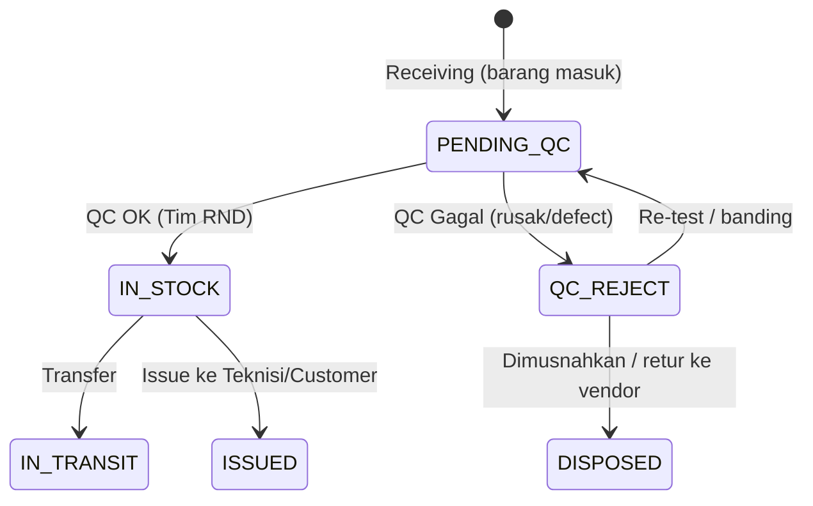

# Planning — QC Barang Masuk (Incoming QC) oleh Tim RND

> Dokumen perencanaan & rekomendasi. **Tidak ada perubahan kode** di tahap ini.
> Tujuan: setiap barang yang masuk (receiving) harus melewati QC oleh Tim RND
> sebelum benar-benar menjadi stok yang bisa dimutasi/diserahkan.

---

## 1. Ringkasan Kebutuhan

Alur yang diminta:

1. **Barang masuk** ke gudang (proses Receiving).
2. **Tim RND login** dan melakukan **QC alat**.
3. Tim QC memilih **Model Device → Serial Number (SN)**.
   - Daftar yang tampil = **semua unit yang BELUM di-QC** di gudang tempat QC bekerja (mis. **gudang East / `WH-REG-EAST`**).
4. Tim QC mengubah status unit menjadi **"QC OK"** → artinya unit sudah lolos QC dan siap dipakai.

Intinya: menambahkan **gerbang QC di sisi penerimaan** (incoming), berbeda dengan QC return yang sudah ada.

---

## 2. Kondisi Saat Ini (hasil telaah kode)

| Aspek | Kondisi sekarang | Lokasi |
|---|---|---|
| Receiving device | Device langsung dibuat `status = IN_STOCK` (tanpa QC) | `PageController::postReceiving()` (~baris 643) |
| QC / Inspeksi | **Hanya untuk device `RETURNED` / `UNDER_QC`** (pasca-return). PASSED → `IN_STOCK` (BEKAS), FAILED → `FLAGGED` | `inspection()` (~1243), `postInspection()` (~1269), `resources/views/inspection.blade.php` |
| Status device | `IN_STOCK, IN_TRANSIT, ISSUED, INSTALLED, RETURNED, UNDER_QC, FLAGGED, LOST, DISPOSED` | `postAdjustDevice()` validasi (~1406) |
| Role/akses | Hanya `super_admin` & `warehouse_admin`. **Belum ada role QC/RND** | `app/Models/User.php` |
| Scope gudang | User punya `warehouse_code`; sesi pakai `active_warehouse_code` (middleware `warehouse`) | `routes/web.php`, middleware `warehouse` |
| Gudang "East" | `WH-REG-EAST` = "Regional Warehouse East" | `database/seeders/DashboardDemoSeeder.php` |
| Transfer/Issue | Mengambil device dengan `status = IN_STOCK` (per gudang) | `transfer()` (~773), `issue()` (~957), `postIssue()`/`postCreateTransfer()` |

### Gap utama
- **Tidak ada tahap QC saat barang masuk.** Begitu di-receiving, unit langsung bisa di-transfer/di-issue.
- **Tidak ada role khusus QC/RND** untuk memisahkan tugas dari admin gudang.
- **Tidak ada jejak audit QC penerimaan** (siapa, kapan, hasil, catatan) untuk unit baru.

---

## 3. Usulan Workflow Baru (Incoming QC)

**Prinsip:** unit hasil receiving **belum** `IN_STOCK`. Ia berstatus `PENDING_QC`
dan **tidak muncul** di daftar transfer/issue sampai Tim RND menyetujui (**QC OK**).

### Langkah operasional
1. **Admin gudang** melakukan receiving seperti biasa (scan/entry SN). Unit tersimpan sebagai `PENDING_QC` di gudang ybs.
2. **Tim RND** login (role QC), sesi gudang = gudang-nya (mis. `WH-REG-EAST`).
3. Buka menu **"QC Penerimaan"**:
   - Filter **Model** → tampil **SN** yang `PENDING_QC` di gudang itu.
   - Pilih satu / banyak unit (centang) → isi hasil QC.
4. **QC OK** → status `IN_STOCK` (siap dimutasi). **QC Reject** → status `QC_REJECT` (terkunci dari mutasi).
5. Semua aksi tercatat di jejak audit (siapa, kapan, hasil, catatan).

---

## 4. Desain Status & Data Model

### 4.1 Opsi A — Berbasis Status (REKOMENDASI)
Tambah status baru **`PENDING_QC`** (dan opsional `QC_REJECT`).

- Receiving meng-set `PENDING_QC` (bukan `IN_STOCK`).
- "QC OK" → `IN_STOCK`.
- Keunggulan: **otomatis memblokir** transfer/issue karena keduanya hanya mengambil `IN_STOCK`. Mental model jelas (1 unit = 1 status).
- Konsekuensi: dashboard "Stok di Gudang" (yang menghitung `IN_STOCK`) **tidak** lagi menghitung unit yang belum QC — ini justru benar (stok = yang sudah lolos QC). Perlu tambah kartu/metrik **"Menunggu QC"**.

### 4.2 Opsi B — Berbasis Flag (alternatif, non-breaking)
Tetap `IN_STOCK`, tambah kolom `qc_status` (`PENDING`/`OK`/`REJECT`).

- Keunggulan: tidak mengubah semantik status lama.
- Kelemahan: transfer/issue **harus** ikut memfilter `qc_status = OK`, kalau lupa → unit belum-QC bisa bocor keluar. Lebih rawan.

> **Rekomendasi: Opsi A** karena paling aman (gating otomatis) dan paling mudah dipahami operator.

### 4.3 Kolom audit yang diusulkan (migration baru, belum dibuat)
Tambahkan ke tabel `devices`:

| Kolom | Tipe | Keterangan |
|---|---|---|
| `qc_status` | string nullable | `PENDING` / `OK` / `REJECT` (jika pakai Opsi A, cukup untuk laporan & re-test) |
| `qc_by` | string/FK user nullable | Petugas QC yang memproses |
| `qc_at` | timestamp nullable | Waktu QC |
| `qc_notes` | text nullable | Catatan hasil QC |

> Catatan: meski Opsi A memakai status, kolom `qc_by/qc_at/qc_notes` tetap berguna
> untuk jejak audit & laporan QC. `unit_condition` (`BARU`/`BEKAS`) yang sudah ada tetap dipakai.

### 4.4 Log transaksi
Manfaatkan `device_transactions` yang sudah ada (pola `logDeviceTransaction`):
- Aksi baru: **`QC_PASSED_INCOMING`** dan **`QC_FAILED_INCOMING`** (atau cukup `QC_PASSED`/`QC_FAILED` dengan lokasi "QC Penerimaan") agar terpisah dari QC return.

---

## 5. Role & Hak Akses

### 5.1 Tambah role baru
Di `app/Models/User.php` tambahkan, mis. `ROLE_QC = 'qc'` (label: "Tim RND / QC").

| Role | Akses QC Penerimaan | Receiving | Transfer/Issue | Master/Settings |
|---|---|---|---|---|
| `super_admin` | ✅ | ✅ | ✅ | ✅ |
| `warehouse_admin` | (lihat saja / opsional) | ✅ | ✅ | ❌ |
| `qc` (baru) | ✅ (proses QC OK/Reject) | (lihat saja, opsional) | ❌ | ❌ |

### 5.2 Route
Tambahkan grup route `role:qc,super_admin` untuk menu QC Penerimaan (mengikuti pola `role:super_admin` yang sudah ada di `routes/web.php`).

### 5.3 Scoping gudang
Petugas QC dibatasi ke gudangnya via `active_warehouse_code` (middleware `warehouse`) — sehingga "tampil semua list yang belum di-QC di gudang East" otomatis terpenuhi saat user QC East login dengan sesi gudang `WH-REG-EAST`.

---

## 6. Halaman "QC Penerimaan" (UI/UX)

Mengikuti pola halaman lain (`x-page-header`, kartu, tabel, `x-empty-state`, modal QC).

### 6.1 Komponen utama
- **Header**: judul "QC Penerimaan", subjudul "Verifikasi unit baru sebelum masuk stok", badge jumlah `PENDING_QC` di gudang aktif.
- **Filter atas**:
  - Dropdown **Model** (searchable) → memuat SN terkait.
  - (Opsional) input scan SN cepat untuk lompat ke unit.
- **Tabel daftar `PENDING_QC`** (scope gudang aktif):
  | Kolom | Isi |
  |---|---|
  | ☑ | checkbox (bulk QC) |
  | SN | serial number |
  | Model / Tipe | `model` / `type` |
  | Kondisi | `unit_condition` (BARU/BEKAS) |
  | Tanggal Masuk | `created_at` / tanggal receiving |
  | Aksi | tombol "Proses QC" |
- **Modal QC** (mirip `inspection.blade.php`): kondisi fisik, catatan, keputusan **QC OK / QC Reject**.
- **Bulk action**: pilih banyak SN sekaligus → "Tandai QC OK" (untuk batch besar yang mulus).

### 6.2 Smart UX (mengikuti pola receiving/transfer yang sudah dirapikan)
- **Default kondisi = BARU** untuk barang baru (smart default).
- **Keyboard shortcut** (Enter untuk submit modal).
- **Feedback visual**: baris hijau saat QC OK, badge merah untuk reject.
- **Empty state** ramah: "Tidak ada unit menunggu QC di gudang ini".
- **Auto-refresh metrik** dashboard via mekanisme `dispatchStockUpdate()` yang sudah ada.

### 6.3 Menu / Navigasi
Tambah item menu **"QC Penerimaan"** di grup **Operasional Gudang** (sidebar), tampil hanya untuk role `qc` & `super_admin`.

---

## 7. Perubahan Teknis yang Diperlukan (saran, belum dieksekusi)

| # | File | Perubahan |
|---|---|---|
| 1 | `database/migrations/*` (baru) | Tambah kolom `qc_status`, `qc_by`, `qc_at`, `qc_notes` di `devices` |
| 2 | `app/Models/Device.php` | Tambahkan kolom baru ke `$fillable` |
| 3 | `app/Models/User.php` | Tambah konstanta `ROLE_QC` + label di array `ROLES` |
| 4 | `PageController::postReceiving()` | Ubah status awal device dari `IN_STOCK` → `PENDING_QC` |
| 5 | `PageController` (method baru) | `incomingQc()` (tampilkan daftar `PENDING_QC` per gudang) + `postIncomingQc()` (set `IN_STOCK`/`QC_REJECT`, isi audit, log transaksi) |
| 6 | `routes/web.php` | Route `GET /qc-penerimaan` & `POST /qc-penerimaan` dalam grup `role:qc,super_admin` |
| 7 | `resources/views/qc_incoming.blade.php` (baru) | Halaman QC sesuai bagian 6 |
| 8 | `resources/views/layouts/app.blade.php` | Item menu "QC Penerimaan" (visible per role) |
| 9 | Validasi status (`postAdjustDevice`, dsb.) | Tambahkan `PENDING_QC`, `QC_REJECT` ke daftar enum yang diizinkan |
| 10 | Dashboard | Tambah kartu/metrik "Menunggu QC" + drill-down |
| 11 | Reports | (Opsional) laporan QC: throughput, lead time receiving→QC, reject rate |

> Catatan kompatibilitas: karena transfer & issue hanya mengambil `IN_STOCK`,
> mengubah receiving ke `PENDING_QC` otomatis menahan unit baru sampai QC selesai —
> **tidak perlu** mengubah query transfer/issue (lebih sedikit risiko regресi).

---

## 8. Aturan Bisnis & Edge Cases

1. **Transfer antar gudang**: keputusannya — QC dilakukan di gudang penerima akhir atau gudang penerimaan awal?
   - Usulan: QC dilakukan **di gudang penerimaan pertama** (saat barang fisik tiba). Transfer hanya boleh untuk unit yang sudah `IN_STOCK` (sudah QC). Jika ingin QC di tujuan, perlu aturan tambahan (lihat Pertanyaan Terbuka).
2. **QC Reject**: unit `QC_REJECT` terkunci dari transfer/issue; opsi lanjut: re-test (→ `PENDING_QC`), retur ke vendor, atau `DISPOSED`.
3. **Barang BEKAS yang masuk lagi**: pakai `unit_condition = BEKAS`; tetap wajib QC.
4. **Bulk QC**: untuk batch besar, izinkan tandai QC OK massal, tapi tetap catat `qc_by/qc_at`.
5. **Idempotensi**: unit yang sudah `IN_STOCK` tidak muncul lagi di daftar QC (cegah double-proses).
6. **Scope ketat**: petugas QC East tidak bisa mem-QC unit gudang lain (dibatasi `active_warehouse_code`).
7. **GSM & Aksesoris**: di luar scope awal (fokus "QC alat"/device). Bisa jadi ekstensi fase berikutnya (mis. QC SIM aktivasi).

---

## 9. Audit, Notifikasi & Laporan

- **Audit**: setiap QC OK/Reject → `device_transactions` + kolom `qc_by/qc_at/qc_notes`.
- **Notifikasi**: badge "Menunggu QC" di header/dashboard; opsional alert bila antrian QC > ambang batas atau unit menunggu QC > X hari.
- **Laporan QC** (opsional):
  - Jumlah unit menunggu QC per gudang.
  - **Lead time** receiving → QC OK (deteksi bottleneck).
  - **Reject rate** per model/vendor (input untuk RND).

---

## 10. Rencana Implementasi Bertahap

| Fase | Lingkup | Output |
|---|---|---|
| **Fase 1 — Inti** | Migration kolom QC, role `qc`, status `PENDING_QC`, ubah receiving, halaman QC (list + modal QC OK/Reject), route, menu | Gerbang QC penerimaan berfungsi end-to-end |
| **Fase 2 — UX & Audit** | Bulk QC, filter model/SN searchable, feedback visual, kartu dashboard "Menunggu QC", log transaksi QC | Operasional nyaman + jejak audit |
| **Fase 3 — Analitik** | Laporan reject rate, lead time, throughput; alert antrian QC | Insight untuk RND & manajemen |
| **Fase 4 — Ekstensi (opsional)** | QC untuk GSM/aksesoris, QC di gudang tujuan transfer | Cakupan penuh |

---

## 11. Acceptance Criteria (Definition of Done) — Fase 1

- [ ] Device hasil receiving berstatus `PENDING_QC`, **tidak** muncul di transfer/issue.
- [ ] Role `qc` bisa login & hanya melihat menu QC (sesuai gudang sesi).
- [ ] Halaman QC menampilkan daftar `PENDING_QC` gudang aktif, bisa filter per **Model** dan pilih **SN**.
- [ ] Aksi **QC OK** mengubah status → `IN_STOCK` dan unit langsung tersedia untuk mutasi.
- [ ] Aksi **QC Reject** mengubah status → `QC_REJECT` (terkunci).
- [ ] Tercatat `qc_by`, `qc_at`, `qc_notes` + entri di `device_transactions`.
- [ ] Petugas QC tidak bisa memproses unit gudang lain.

---

## 12. Risiko & Mitigasi

| Risiko | Dampak | Mitigasi |
|---|---|---|
| Definisi "stok" berubah (IN_STOCK kini = sudah QC) | Angka dashboard turun | Tambah kartu "Menunggu QC"; sosialisasi ke user |
| Antrian QC menumpuk → barang tertahan | Operasional lambat | Bulk QC + alert antrian + laporan lead time |
| Lupa filter `qc_status` (bila pilih Opsi B) | Unit belum-QC bocor keluar | Pilih **Opsi A** (gating via status) |
| Data lama (sebelum fitur) tanpa `qc_status` | Inkonsistensi | Backfill: unit `IN_STOCK` lama dianggap `qc_status = OK` |

---

## 13. Pertanyaan Terbuka (perlu keputusan sebelum implementasi)

1. **Lokasi QC**: hanya di gudang penerimaan pertama, atau juga di gudang tujuan transfer?
2. **Status pakai Opsi A (`PENDING_QC`) atau Opsi B (flag `qc_status`)?** (rekomendasi: A)
3. **Role**: cukup satu role `qc` global, atau perlu `qc` per-area (East/West)? (scope gudang sesi sudah menutup ini, tapi mohon dikonfirmasi)
4. **QC Reject lanjutannya** apa: re-test, retur vendor, atau langsung `DISPOSED`?
5. Apakah **GSM & aksesoris** juga perlu QC penerimaan, atau cukup device dulu?
6. Apakah perlu **approval berjenjang** (QC officer → QC lead) atau cukup satu langkah?

---

*Dokumen ini hanya perencanaan. Implementasi menunggu konfirmasi atas Pertanyaan Terbuka di atas.*
