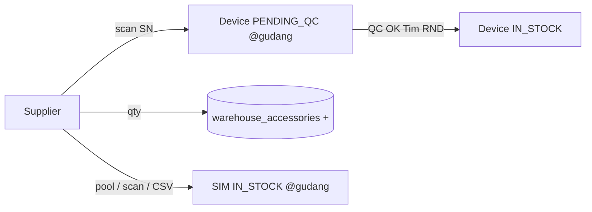
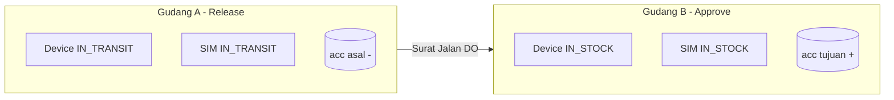
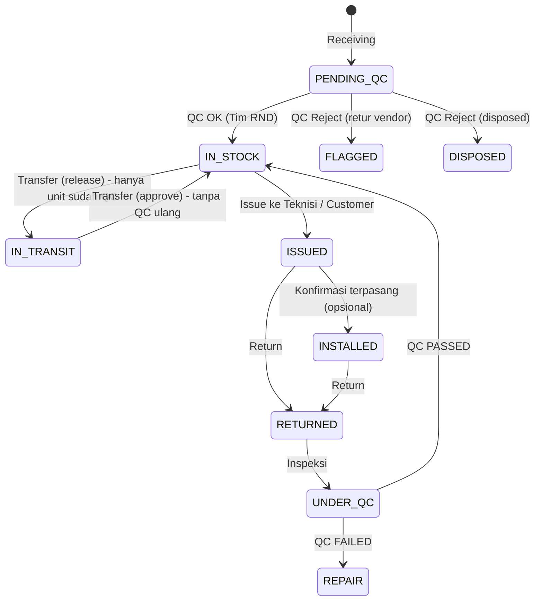

# Workflow Operasional Gudang — Device, GSM/SIM, Aksesoris

> Dokumen ini memetakan **alur mutasi stok** (pergerakan masuk/keluar) untuk 3 jenis item — **Device**, **Kartu GSM/SIM**, dan **Aksesoris** — pada setiap menu di grup **Operasional Gudang**, sesuai kode aplikasi saat ini. Disertai hasil _debug_ (temuan inkonsistensi) dan rekomendasi perbaikan.

- Basis kode: `app/Http/Controllers/PageController.php`, `app/Services/DashboardInsightService.php`, `app/Services/ReportService.php`
- Menu grup **Operasional Gudang**: **Penerimaan (Receiving)** · **Transfer Gudang** · **Issue / Serah Terima** · **Return Perangkat**
- Menu pendukung (grup _Kontrol & Kualitas_) yang terkait alur: **QC & Inspeksi**, **Stock Opname**

---

## 1. Model Data Stok (Sumber Kebenaran)

| Item | Cara hitung stok | Tabel / kolom | Status lifecycle | Log audit |
|---|---|---|---|---|
| **Device** | Per-unit (1 baris = 1 unit) | `devices.status`, `devices.warehouse_code`, `devices.current_holder`, `devices.qc_by/qc_at/qc_notes` | `PENDING_QC → IN_STOCK → IN_TRANSIT → IN_STOCK → ISSUED → INSTALLED → RETURNED → UNDER_QC → IN_STOCK`. QC reject → `FLAGGED` (retur vendor) / `DISPOSED` | `device_transactions` |
| **GSM/SIM** | Per-unit | `gsm_simcards.status`, `gsm_simcards.warehouse_code`, `gsm_simcards.gsm_simcard_id`(pairing di device) | `IN_STOCK → IN_TRANSIT → INSTALLED → (RETURN) → IN_STOCK` | `simcard_transactions` |
| **Aksesoris** | Berbasis kuantitas (saldo) | `accessories.qty` (global), `warehouse_accessories.qty` (per gudang), `holder_accessories.qty` (teknisi/customer) | — (tidak ada status, hanya saldo) | `accessory_transactions` |

**Catatan kunci:**
- Device & SIM = **unit individual** (punya status). Aksesoris = **saldo angka** (tidak ada status, hanya bertambah/berkurang).
- Setiap mutasi memanggil `dispatchStockUpdate()` → broadcast `GlobalStockUpdated` (real-time dashboard).

---

## 2. Matriks Dukungan per Menu

| Menu | Device | GSM/SIM | Aksesoris |
|---|:---:|:---:|:---:|
| **Receiving** | ✅ scan SN | ✅ pool / scan / CSV | ✅ qty |
| **Transfer** | ✅ (DO + approve) | ✅ (DO + approve) | ✅ (DO + approve) |
| **Issue / Serah Terima** | ✅ scan SN | ✅ pairing ke device | ✅ qty (OUT) |
| **Return** | ✅ scan SN | ✅ unbind dari device | ✅ qty (RETURN) |

---

## 3. Detail Alur per Menu

### 3.1 Penerimaan (Receiving) — `receiving()`

Barang masuk dari supplier ke gudang. 3 tab terpisah.

| Item | Endpoint | Mutasi stok | Log |
|---|---|---|---|
| Device | `postReceiving()` | Buat `Device` baru **`status=PENDING_QC`** (wajib QC dulu), `warehouse_code=tujuan` | `device_transactions: RECEIVING` |
| Aksesoris | `postReceivingAccessory()` → `processAccessoryQtyForm('RECEIVING')` | `accessories.qty +`, `warehouse_accessories.qty +` (tanpa QC) | `accessory_transactions: RECEIVING` |
| GSM/SIM | `postReceivingSimcard()` | 3 mode: **pool** (centang), **manual/scan**, **bulk CSV** → set `status=IN_STOCK`, `warehouse_code=tujuan` (tanpa QC) | `simcard_transactions: RECEIVING` |

> **Catatan QC:** hanya **device** yang wajib lewat QC penerimaan. GSM & aksesoris langsung jadi stok.

### 3.1b QC Penerimaan (Incoming QC) — `qualityControl()` / `postQcIncoming()`

Tim **RND/QC** (role `qc`) memverifikasi unit baru sebelum jadi stok. Ada di menu terpadu **Quality Control → tab "Barang Masuk"** (gabungan dengan QC Return/Inspeksi & Laporan QC dalam satu menu).

| Aksi | Hasil status | Log |
|---|---|---|
| **QC OK** | `IN_STOCK` (siap dimutasi), isi `qc_by/qc_at/qc_notes`, kondisi BARU/BEKAS | `device_transactions: QC_PASSED` |
| **Reject → Re-test** | tetap `PENDING_QC` (uji ulang) | `QC_RETEST` |
| **Reject → Retur Vendor** | `FLAGGED` (karantina) | `QC_FAILED` |
| **Reject → Disposed** | `DISPOSED` | `QC_FAILED` |

- Daftar QC **ter-scope ke gudang aktif** (`active_warehouse_code`) → "tampil semua yang belum di-QC di gudang itu (mis. East / `WH-REG-EAST`)".
- Pilih **Model → SN**, mendukung **bulk** (centang banyak unit sekaligus).
- Selama `PENDING_QC`, unit **tidak muncul** di Transfer/Issue (keduanya hanya ambil `IN_STOCK`).

### 3.2 Transfer Gudang — `transfer()`

Pola **2 langkah**: Gudang A `Release Shipment` (buat Surat Jalan / DO) → Gudang B `Approve & Put in Stock`.

| Item | Saat Release (`postCreateTransfer`) | Saat Approve (`postApproveTransfer`) |
|---|---|---|
| Device | `status=IN_TRANSIT`, attach ke DO | `status=IN_STOCK`, `warehouse_code=tujuan` (tanpa QC ulang — hanya unit yang sudah QC/IN_STOCK yang boleh ditransfer) |
| Aksesoris | `accessories.qty -`, `warehouse_accessories(asal) -`, attach ke DO (qty) | `accessories.qty +`, `warehouse_accessories(tujuan) +` |
| GSM/SIM | `status=IN_TRANSIT`, attach ke DO (`delivery_order_simcards`) | `status=IN_STOCK`, `warehouse_code=tujuan` |
| Log | `*_transactions: TRANSFER_OUT` | `*_transactions: TRANSFER_IN` |

### 3.3 Issue / Serah Terima — `postIssue()`

Menyerahkan ke **Teknisi** atau **Customer**. Output: Tanda Terima (PDF) otomatis.

| Item | Mutasi | Catatan |
|---|---|---|
| Device | `status=ISSUED` (teknisi **maupun** customer), `current_holder=Technician: NAMA / Customer: NAMA`. Jika customer → buat `customer_devices`. | Status **bukan** `INSTALLED` — "Stok di Customer" tetap terpantau. Plat kendaraan opsional (`vehicle_plates[sn]`) |
| GSM/SIM | SIM ter-pairing ke device (`sim_pairings[sn]`): `status=INSTALLED` (fisik tertanam di device), `warehouse_code=null`. SIM mandiri (`issue_sim_ids`): `status=ISSUED`, `warehouse_code=null` | SIM keluar dari stok gudang |
| Aksesoris | `processAccessoryQtyForm('OUT')`: `accessories.qty -`, `warehouse_accessories -`, `holder_accessories +` | Saldo holder (teknisi/customer) **bertambah** = stok di customer |
| Log | `device: ISSUED`, `sim: INSTALLED` (pairing) / `ISSUED` (mandiri), `accessory: OUT` (semua bawa nomor `receiptNo`) | |

### 3.4 Return Perangkat — `postReturn()`

Pengembalian dari teknisi/customer ke gudang. Setelah return → masuk antrian **QC/Inspeksi**.

| Item | Mutasi | Catatan |
|---|---|---|
| Device | `status=RETURNED`, `warehouse_code=gudang`, `gsm_simcard_id=null`. Unbind `customer_devices`. | **Belum** `IN_STOCK` — harus lewat QC |
| GSM/SIM | SIM ter-pairing dikembalikan: `status=IN_STOCK`, `warehouse_code=gudang` | Otomatis ikut saat device di-return |
| Aksesoris | `processAccessoryQtyForm('RETURN')`: `accessories.qty +`, `warehouse_accessories +`, `holder_accessories -` | Saldo holder **berkurang** bila "Dikembalikan Oleh" dipilih |
| Log | `device: RETURNED`, `sim: RETURNED`, `accessory: RETURN` | |

---

## 4. Hasil Debug — Temuan & Inkonsistensi

| # | Tingkat | Status | Temuan | Lokasi |
|---|---|---|---|---|
| 1 | 🔴 Tinggi | ✅ **Selesai** | **Issue ke Customer tidak pernah set device `INSTALLED`** — tetap `ISSUED`. Kini Issue ke customer → `INSTALLED`, ke teknisi → `ISSUED`. | `postIssue()` |
| 2 | 🟠 Sedang | ✅ **Selesai** | **Sumber gudang aksesoris saat Issue mengikuti device terakhir.** Kini memakai field "Gudang Asal" eksplisit sebagai sumber stok. | `postIssue()` |
| 3 | 🟠 Sedang | ✅ **Selesai** | **Daftar SIM di Issue tidak difilter per gudang.** Kini SIM (& device & aksesoris) difilter per gudang asal; pairing SIM lintas gudang ditolak server. | `issue()`, `postIssue()` |
| 4 | 🟠 Sedang | ✅ **Selesai** | **Transfer/Issue device tidak memvalidasi gudang asal.** Kini divalidasi `warehouse_code = from` (client + server). | `postCreateTransfer()`, `postIssue()` |
| 5 | 🟡 Rendah | ⬜ Terbuka | **Aksesoris hasil Return langsung nambah stok gudang** tanpa QC, sedangkan device wajib QC dulu. | `postReturn()` |
| 6 | 🟡 Rendah | 🟨 Sebagian | **Return mandiri SIM kini didukung** (SIM yang diserahkan tanpa device bisa direturn ke gudang). Sisa: alur QC khusus untuk SIM/aksesoris **rusak** (REPAIR/SCRAP) belum ada. | `postReturn()` |
| 7 | 🟡 Rendah | ⬜ Terbuka | **Atribusi holder berbasis string** rapuh bila nama berubah/duplikat. | `processAccessoryQtyForm`, holder backfill |
| 8 | 🟡 Rendah | ✅ **Selesai** | **Qty transfer/issue aksesoris tak divalidasi server-side.** Kini divalidasi via `validateAccessoryStock()` sebelum transaksi. | `postCreateTransfer()`, `postIssue()` |

---

## 5. Rekomendasi (Prioritas)

### Prioritas 1 — Konsistensi status & stok
1. **Tandai device `INSTALLED` saat Issue ke Customer** (atau saat QC instalasi), agar metrik "Installed" akurat di alur web. Alternatif: ubah label kartu jadi "Issued ke Customer" bila memang INSTALLED khusus konfirmasi lapangan via mobile.
2. **Pisahkan "Gudang Asal Aksesoris" sebagai field eksplisit** di Issue (jangan ikut device terakhir). Validasi qty ≤ `warehouse_accessories` di server.
3. **Filter daftar SIM pairing per `warehouse_code` device** di halaman Issue, dan tolak pairing SIM lintas gudang di server.

### Prioritas 2 — Integritas mutasi
4. **Validasi gudang asal** untuk device pada Transfer & Issue (`where warehouse_code = from`).
5. **Validasi qty server-side** untuk transfer/issue aksesoris terhadap saldo gudang; gagalkan transaksi bila melebihi.

### Prioritas 3 — Kelengkapan lifecycle
6. **Alur Return/QC mandiri untuk SIM & aksesoris** (mis. SIM rusak → status `REPAIR/SCRAP`; aksesoris rusak → tidak langsung nambah stok bagus).
7. **Normalisasi atribusi holder** memakai `holder_type` + `holder_code` (FK) konsisten, hentikan parsing string.
8. **Activity feed real-time** lintas item (device/SIM/aksesoris) di dashboard memanfaatkan `*_transactions` agar "pergerakan" terlihat hidup, bukan hanya angka.

### Prioritas 4 — Observability
9. **Satukan tampilan mutasi** (Live Transaction Stream saat ini hanya `device_transactions`) agar juga menampilkan `simcard_transactions` & `accessory_transactions`.
10. **Ramping-kan payload broadcast** (`getBroadcastPayload`) — kirim ringkasan metrik saja, detail via AJAX, untuk hindari limit ukuran Reverb.

---

## 6. Ringkasan Status Implementasi Saat Ini

✅ **Sudah lengkap:** Receiving (3 item), Transfer (3 item, 2 langkah), Issue (device+SIM pairing+**serah terima SIM mandiri**+aksesoris), Return (device+SIM unbind+**return SIM mandiri**+aksesoris), saldo holder aksesoris real, log audit ketiga item, broadcast real-time, kartu dashboard Aksesoris & SIM.

⚠️ **Perlu perbaikan (tersisa):** temuan #6 (QC khusus item **rusak** — REPAIR/SCRAP) & #7 (normalisasi atribusi holder).

---

## 7. Changelog Perbaikan

**Iterasi terbaru — filter per gudang, status INSTALLED, persistensi tab, mutasi GSM:**
- **Issue** kini berbasis **Gudang Asal**: daftar device (validasi scan), SIM pairing (dibangun ulang, difilter per gudang), dan stok/`max` aksesoris semuanya difilter per gudang. (temuan #2, #3)
- **Status mutasi**: Issue ke **customer maupun teknisi → `ISSUED`** (bukan `INSTALLED`). Tujuannya agar admin gudang bisa memantau **"Stok di Customer"** (berapa unit ada di customer). `INSTALLED` hanya untuk perangkat yang benar-benar dipasang.
- **Transfer & Issue**: validasi device & SIM harus milik gudang asal (client + server). (temuan #4)
- **Validasi qty aksesoris** server-side terhadap stok gudang asal di Issue & Transfer. (temuan #8)
- **Receiving**: setelah simpan, halaman tetap di tab terkait (Device/Aksesoris/Kartu GSM) via `?tab=`.
- **Transfer Kartu GSM** dipermudah: quick-add scan MSISDN, tombol "Pilih Semua"/"Bersihkan", indikator jumlah SIM tersedia di gudang asal, dan integritas gudang asal di server.

**Serah terima & return SIM mandiri:**
- **Issue**: kartu "Serahkan Kartu GSM (Opsional)" — serahkan SIM langsung ke teknisi/customer tanpa device (status → `INSTALLED`/`ISSUED`, `warehouse_code=null`, log `SimcardTransaction`).
- **Return**: kartu "Return Kartu GSM (Opsional)" — SIM mandiri yang dipegang teknisi/customer (tidak terikat device) bisa dikembalikan ke gudang penerima (status → `IN_STOCK`, `warehouse_code` = gudang, log `RETURNED`). (temuan #6, sebagian)
